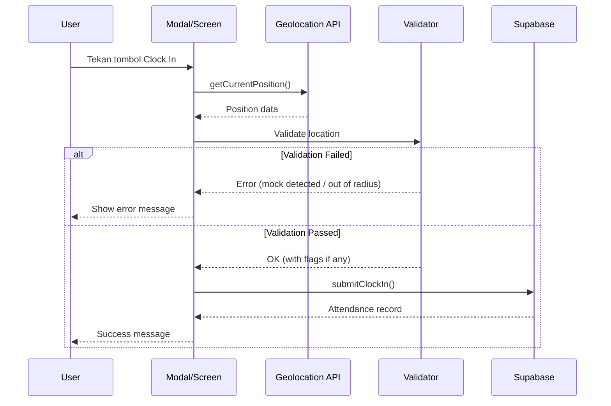
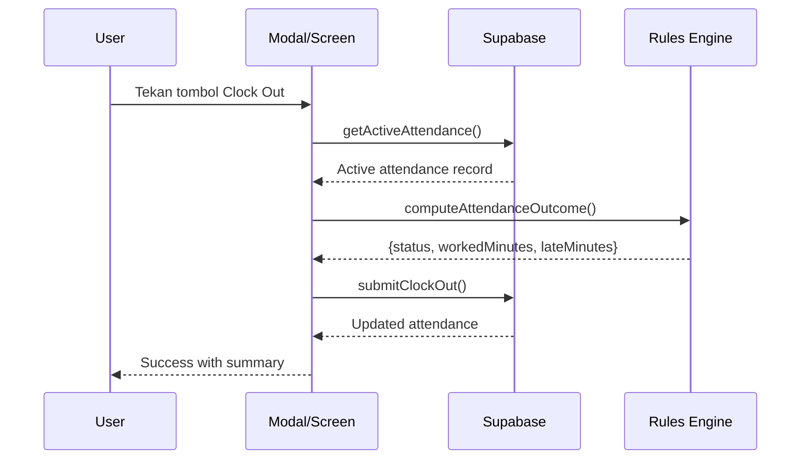

# Workflow Sistem Absensi HRIS

Dokumentasi lengkap mekanisme, flow, dan logika sistem absensi untuk platform Web dan Mobile.

---

## Daftar Isi

1. [Arsitektur Sistem](#arsitektur-sistem)
2. [Komponen Utama](#komponen-utama)
3. [Flow Absensi](#flow-absensi)
4. [Validasi & Rules](#validasi--rules)
5. [Mock Location Detection](#mock-location-detection)
6. [Offline Support (Mobile)](#offline-support-mobile)
7. [Database Schema](#database-schema)

---

## Arsitektur Sistem

```
┌─────────────────────────────────────────────────────────────────────┐
│                          USER INTERFACE                              │
├─────────────────────────────┬───────────────────────────────────────┤
│         WEB (React)         │           MOBILE (React Native)       │
│  - absensiPage.tsx          │  - ClockScreen.tsx                    │
│  - ClockInOutModal.tsx      │  - AttendanceScreen.tsx               │
│  - AttendanceMap.tsx        │                                       │
└─────────────────────────────┴───────────────────────────────────────┘
                                    │
                                    ▼
┌─────────────────────────────────────────────────────────────────────┐
│                         SERVICE LAYER                                │
├─────────────────────────────────────────────────────────────────────┤
│  attendanceService         │  Location Utils    │  Attendance Rules │
│  - submitClockIn()         │  - findNearestWP() │  - buildWindow()  │
│  - submitClockOut()        │  - getDistance()   │  - validateClock()│
│  - submitClockEvent()      │  - WORKPLACES[]    │  - computeOutcome()│
└─────────────────────────────────────────────────────────────────────┘
                                    │
                                    ▼
┌─────────────────────────────────────────────────────────────────────┐
│                          DATABASE (Supabase)                         │
├─────────────────────────────────────────────────────────────────────┤
│  attendance    │  work_schedules  │  requests   │  profiles         │
│  shifts        │  sections        │  departments│                   │
└─────────────────────────────────────────────────────────────────────┘
```

---

## Komponen Utama

### Web Platform
| File | Deskripsi |
|------|-----------|
| `src/app/(app)/(bawahan)/absensiPage.tsx` | Halaman utama absensi karyawan |
| `src/components/modals/ClockInOutModal.tsx` | Modal clock-in/out dengan peta |
| `src/components/maps/AttendanceMap.tsx` | Komponen peta Leaflet |
| `src/services/attendance/index.ts` | Service layer untuk API |
| `src/lib/attendanceRules.ts` | Logika window waktu & outcome |
| `src/lib/location.ts` | Utilitas lokasi & workplace |

### Mobile Platform
| File | Deskripsi |
|------|-----------|
| `mobile/src/screens/ClockScreen.tsx` | Screen utama clock-in/out |
| `mobile/src/screens/AttendanceScreen.tsx` | Riwayat absensi |
| `mobile/src/lib/attendanceRules.ts` | Logika window (shared) |
| `mobile/src/lib/offlineQueue.ts` | Queue untuk offline mode |
| `mobile/src/lib/localCache.ts` | Cache lokal untuk offline |

---

## Flow Absensi

### Clock-In Flow



### Clock-Out Flow



---

## Validasi & Rules

### Validation Levels (Web)

```typescript
enum ValidationLevel {
  NORMAL = 'normal',           // Semua OK, notes opsional
  NOTES_REQUIRED = 'notes_required', // Boleh clock, notes wajib
  APPROVAL_REQUIRED = 'approval_required', // Kirim ke atasan
  BLOCKED = 'blocked',         // Tidak bisa proceed
}
```

### Kondisi & Level

| Kondisi | Level | Action |
|---------|-------|--------|
| Dalam radius, jadwal ada | NORMAL | Clock langsung |
| Hari OFF / tidak ada jadwal | NOTES_REQUIRED | Wajib isi alasan |
| Akurasi GPS rendah (>250m) | NOTES_REQUIRED | Wajib isi alasan |
| Mock confidence 60-90% | NOTES_REQUIRED | Wajib isi alasan |
| Di luar radius (>350m) | BLOCKED | Gunakan mode "Lainnya" |
| Mode "Lainnya" | APPROVAL_REQUIRED | Kirim ke atasan |
| Mock confidence 90%+ | BLOCKED | Tidak bisa clock |

### Clock Window Rules

Diatur di `attendanceRules.ts`:

```typescript
const SHIFT_WINDOW_PRESETS = {
  shift1: { 
    graceMinutes: 10,
    clockInWindow: [-30, 90],   // 30 menit sebelum - 90 menit setelah
    clockOutWindow: [-30, 180]  // 30 menit sebelum - 3 jam setelah
  },
  shift2: { /* sama */ },
  shift3: { 
    clockInWindow: [-60, 120],  // Lebih longgar untuk shift malam
    clockOutWindow: [-60, 180]
  },
};
```

### Outcome Calculation

```typescript
function computeAttendanceOutcome(params) {
  const lateMinutes = clockIn > shiftStart + grace ? diff : 0;
  const earlyLeaveMinutes = clockOut < shiftEnd - grace ? diff : 0;
  
  let status = 'hadir';
  if (earlyLeaveMinutes > 0) status = 'pulang_cepat';
  else if (lateMinutes > 0) status = 'terlambat';
  
  return { status, workedMinutes, lateMinutes, earlyLeaveMinutes };
}
```

---

## Mock Location Detection

### Web Heuristics (7 checks)

| # | Heuristic | Confidence | Keterangan |
|---|-----------|------------|------------|
| 1 | Coordinate precision | +15% | >8 decimal places |
| 2 | Integer accuracy | +15% | Akurasi bulat sempurna (5.0, 10.0) |
| 3 | Integer altitude | +10% | Ketinggian bulat sempurna |
| 4 | Timestamp consistency | +25% | Timestamp sama antar sample |
| 5 | Coordinate variance | +30% | Koordinat identik antar sample |
| 6 | Unrealistic speed | +20% | >50 m/s antara sample |
| 7 | DevTools detection | +10% | Window size mismatch |

### Multi-Sample Validation

```
Sample 1 ──400ms──> Sample 2 ──400ms──> Sample 3
                                            │
                                            ▼
                                    analyzeSamples()
                                            │
                    ┌───────────────────────┼───────────────────────┐
                    ▼                       ▼                       ▼
               0-30%                   30-60%                   60-90%               90%+
              NORMAL                  WARNING              NOTES_REQUIRED          BLOCKED
```

### Mobile Detection

```typescript
// JailMonkey untuk deteksi
if (location.mocked) return { isMock: true, confidence: 100 };
if (JailMonkey.canMockLocation()) return { isMock: true, confidence: 90 };
```

---

## Offline Support (Mobile)

### Offline Queue Service

```typescript
// Enqueue saat offline
await offlineQueue.enqueue({
  type: 'clock_in',
  timestamp: now,
  payload: { profile_id, clock_in, coords, address }
});

// Auto-sync saat online
offlineQueue.addListener((status) => {
  if (status.pendingCount === 0) console.log('Synced!');
});
```

### Local Cache

```typescript
// Cache jadwal untuk offline
await localCache.cacheTodaySchedule({ shift_code, shift });

// Ambil dari cache saat offline
const cached = await localCache.getCachedTodaySchedule();
```

---

## Database Schema

### Table: attendance

| Column | Type | Description |
|--------|------|-------------|
| id | uuid | Primary key |
| profile_id | uuid | FK ke profiles |
| clock_in | timestamp | Waktu clock in |
| clock_out | timestamp | Waktu clock out |
| work_date | date | Tanggal kerja |
| status | enum | hadir/terlambat/pulang_cepat/absent |
| lokasi_kerja | text | 'Bekerja di Pabrik' / 'Lainnya' |
| tempat_kerja | text | Nama workplace (Tonasa 4, Palmer, dll) |
| clock_in_coords | jsonb | {lat, lon} |
| clock_out_coords | jsonb | {lat, lon} |
| clock_in_address | text | Alamat dari reverse geocoding |
| clock_out_address | text | Alamat dari reverse geocoding |
| worked_minutes | int | Total menit kerja |
| late_minutes | int | Menit keterlambatan |
| early_leave_minutes | int | Menit pulang cepat |
| catatan | text | Notes + validation flags |
| source | text | 'MANUAL' / 'mobile_app' / 'mobile_app_offline' |

### Table: work_schedules

| Column | Type | Description |
|--------|------|-------------|
| id | uuid | Primary key |
| profile_id | uuid | FK ke profiles |
| date | date | Tanggal |
| shift_code | text | Kode shift (S1, S2, S3, OFF) |

### Table: shifts

| Column | Type | Description |
|--------|------|-------------|
| id | uuid | Primary key |
| code | text | Kode shift |
| name | text | Nama shift |
| start_time | time | Jam mulai |
| end_time | time | Jam selesai |

---

## Workplace Configuration

```typescript
const WORKPLACES = [
  { name: 'Tonasa 23', lat: -4.783714, lon: 119.616100 },
  { name: 'Tonasa 4', lat: -4.788318, lon: 119.616540 },
  { name: 'Tonasa 5', lat: -4.790931, lon: 119.616948 },
  { name: 'Crusher', lat: -4.789325, lon: 119.620397 },
  { name: 'Kantor Staf', lat: -4.788360, lon: 119.613099 },
  { name: 'Palmer', lat: -4.799717, lon: 119.603086 },
];

const MAX_DISTANCE_METERS = 350;
const ACCURACY_THRESHOLD_METERS = 250;
```

---

## Catatan Penting

1. **Timezone:** Semua waktu menggunakan WITA (Asia/Makassar, +08:00)
2. **Cross-day shifts:** Shift malam yang melewati tengah malam didukung
3. **Bypass mode:** Admin dapat mengaktifkan bypass untuk situasi darurat
4. **Koreksi:** Karyawan dapat mengajukan koreksi maksimal 3 hari ke belakang

---

*Dokumentasi ini dibuat pada 20 Desember 2024*
